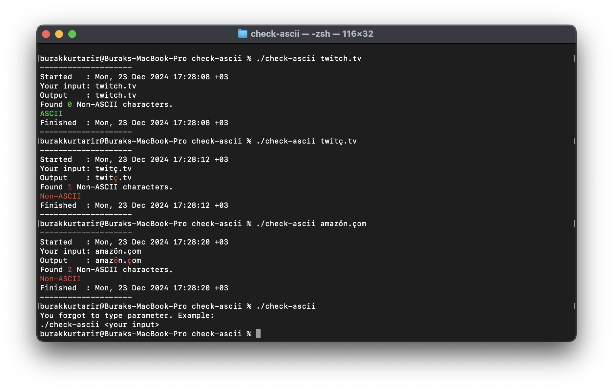

# Check ASCII

Console app developed in Go. Checks if a string is ASCII or not.

## How to use
```bash
./check-ascii <your text>
```
or
```bash
go run main.go <your text>
```

## Examples
```bash
--------------------
./check-ascii twitch.tv

Started   : Mon, 23 Dec 2024 17:14:44 +03
Your input: twitch.tv
Output    : twitch.tv
Found 0 Non-ASCII characters.
ASCII
Finished  : Mon, 23 Dec 2024 17:14:44 +03
--------------------
```

```bash
./check-ascii twitçh.tv 

--------------------
Started   : Mon, 23 Dec 2024 17:26:35 +03
Your input: twitçh.tv
Output    : twitçh.tv
Found 1 Non-ASCII characters.
Non-ASCII
Finished  : Mon, 23 Dec 2024 17:26:35 +03
--------------------
```

## Previews

